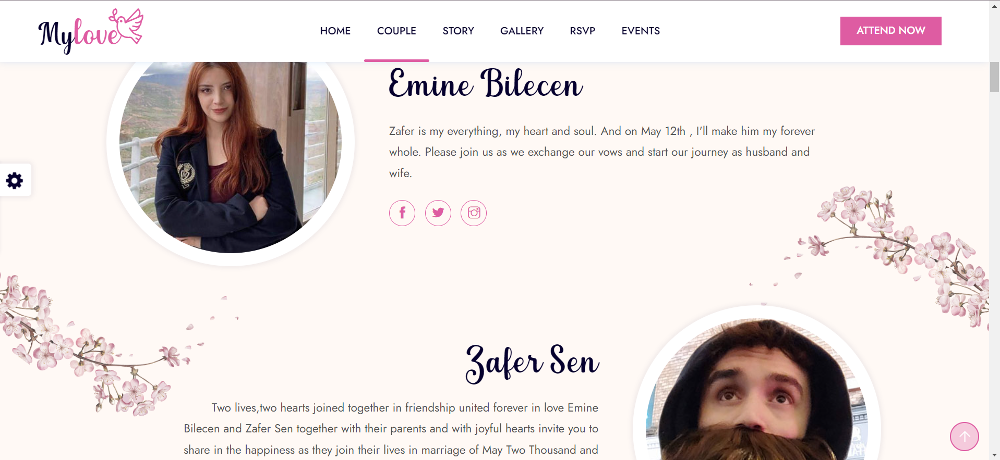
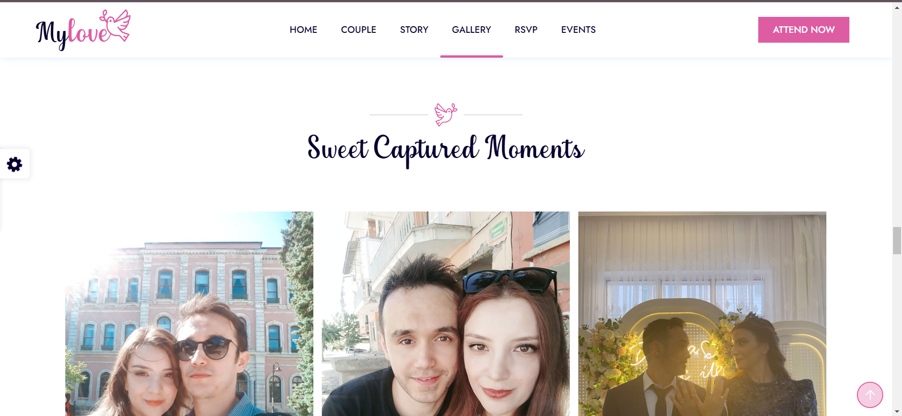

# mylove_wedding_html5_template
HTML5 wedding invitation website template, please refer to the original page: https://wpocean.com/html/tf/mylove-live/, This repo has been created thanks to the wpocean team's template. 

## Please note that: I am an embedded system engineer, So I have no experience with web development and related tools. I just wanted to develop quickly this webpage to surprise my gf and for fun. I have no commercial reasons for this. So during the development of this template, I learned everything from the internet, So this development may have many issues and an inappropriate development style.  I spent a week developing this, You can start quickly by downloading and deploying it into your hosting if you do not have any commercial considerations.<br>

Here is my work: https://eminezafer.love/

Please do not hesitate to share your opinion with me. 
#


# Mylove - Wedding HTML5 Template - Wedding Site Templates

Mylove – is a clean, unique, responsive Html5 wedding template. It is a modern, beautiful, elegant wedding template. We have tried to use modern tools like Html5, CSS3, Bootstrap, for building this template. Couple details, Love story, Countdown, Groomsmen and Bridesmaids, Events almost all kinds of wedding features we have tried to put into it. RSVP form can send an email. It has a unique design with amazing features for couples who want to build their wedding website. It looks great on mobile devices and desktops. It is clean and simple.

### Mylove comes with 35 page

+ Main Features
+ 4 Home Style
+ Invitation
+ Coming Soon
+ Modern Design
+ HTML5 & CSS3 & jQuery
+ Fully Responsive
+ Free Google Fonts
+ Flat Icon
+ WC3 Validated
+ Working Ajax Contact Form
+ CSS3 Animation
+ Paralax Background
+ Well Documented
+ Easy Customization
+ Cross browser Support
+ And Much more…
+ Bootstrap 5 Based
+ Detecting browser language and auto load webpage language(Supporting EN and TR)
+ Contact form and storing into MySQL database
+ reCAPTCHA v2 widget for the form

### CSS and JavaScripts Libraries

+ Bootstrap 5
+ flaticon
+ Owl Carousel
+ Localization

### PhotoCredit
+ Freepik
+ Unsplash


MySQL Database table structure:

```
CREATE TABLE `weddcontact` (
  `contact_id` int(11) NOT NULL AUTO_INCREMENT,
  `user_name` varchar(100) NOT NULL,
  `user_email` varchar(255) NOT NULL,
  `status` varchar(255) NOT NULL,
  `numofguests` tinyint(4) NOT NULL,
  `country` varchar(255) NOT NULL,
  `message` text NOT NULL,
  PRIMARY KEY (`contact_id`)
) ENGINE=InnoDB AUTO_INCREMENT=0 DEFAULT CHARSET=utf8mb4 COLLATE=utf8mb4_unicode_520_ci

```

In case if the hosting is off: see the demo preview over the SS:








